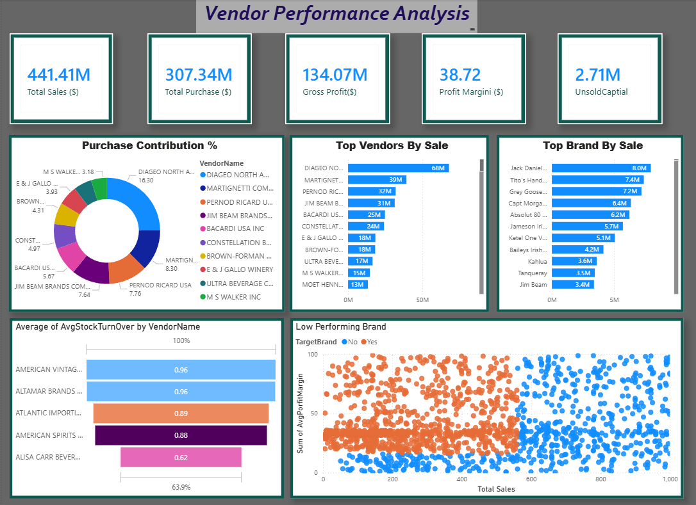

# 🧾 Vendor Performance Analysis – Retail Inventory & Sales

End-to-end analysis of vendor efficiency and profitability to optimize purchasing and inventory strategy using SQL, Python, and Power BI

--- 
## 📌 Table of Contents
- <a herf="#overview">Overview</a>
- <a herf="#business-problem">Business Problem</a>
- <a herf="#Dataset">Dataset</a>
- <a herf="#tools-technologies">Tools & Technologies</a>
- <a herf="#project-structure">Project Structure</a>
- <a herf="#data-cleaning--perpartion">Data Clearning & Prepration</a>
- <a herf="#exploratory-data-analysis-eda">Exploratory Data Analysis (EDA)</a>
- <a herf="#research-question--key-findings">Research Questions & Key findings</a>
- <a herf="#dashboard">Dashboard</a>
- <a herf="how-to-run-this-project">How to run this project</a>
- <a herf="#final-recommendations">Final Recommendations</a>
- <a herf="#author-contact">Author & Contact</a>

---
<h2><a class="achor" id="overview"></a>Overview</h2>
This project analyzes vendor performance and retail inventory dynamics to deliver strategic insights for purchasing, pricing, and inventory optimization. A complete data pipeline was developed using SQL for ETL, Python for analysis and hypothesis testing, and Power BI for visualization.

---

<h2><a class="anchor" id="business-problem"></a>Business Problem</h2>

Effective inventory and sales management are critical in the retail sector. This project aims to:

- Identify underperforming brands needing pricing or promotional adjustments
- Determine vendor contributions to sales and profits
- Analyze the cost-benefit of bulk purchasing
- Investigate inventory turnover inefficiencies
- Statistically validate differences in vendor profitability

---

<h2><a class="achor" id="Dataset"></a>Dataset</h2>

- Multiple CSV files located in /data/ folder (sales, vendors, inventory)
- Summary table created from ingested data and used for analysis

---

<h2><a class="achor" id="tools-technologies"></a>Tools & Technologies</h2>

- SQL (Common Table Expressions, Joins, Filtering)
- Python (Pandas, Matplotlib, Seaborn, SciPy)
- Power BI (Interactive Visualizations)
- GitHub
---
<h2><a class="achor" id="project-structure"></a>Project Structure</h2>
```
vendor-performance-analysis/
│
├── README.md
├── .gitignore
├── requirements.txt
├── Vendor Performance Report.pdf
│
├── notebooks/                  # Jupyter notebooks
│   ├── exploratory_data_analysis.ipynb
│   ├── vendor_performance_analysis.ipynb
│
├── scripts/                    # Python scripts for ingestion and processing
│   ├── ingestion_db.py
│   └── get_vendor_summary.py
│
├── dashboard/                  # Power BI dashboard file
│   └── vendor_performance_dashboard.pbix
```
---

<h2><a class="achor" id="data-cleaning--perpartion"></a>Data Clearning & Prepration</h2>

- Removed transactions with:
    - Gross Profit ≤ 0
    - Profit Margin ≤ 0
    - Sales Quantity = 0
- Created summary tables with vendor-level metrics
- Converted data types, handled outliers, merged lookup tables

---

<h2><a class="achor" id="exploratory-data-analysis-eda"></a>Exploratory Data Analysis (EDA)</h2>

Negative or Zero Values Detected:

 - Gross Profit: Min -52,002.78 (loss-making sales)
 - Profit Margin: Min -∞ (sales at zero or below cost)
 - Unsold Inventory: Indicating slow-moving stock

Outliers Identified:

 - High Freight Costs (up to 257K)
 - Large Purchase/Actual Prices

Correlation Analysis:

 - Weak between Purchase Price & Profit
 - Strong between Purchase Qty & Sales Qty (0.999)
 - Negative between Profit Margin & Sales Price (-0.179)

---

<h2><a class="achor" id="research-question--key-findings"></a>Research Questions & Key findings</h2>

    1.Brands for Promotions: 198 brands with low sales but high profit margins
    2.Top Vendors: Top 10 vendors = 65.69% of purchases → risk of over-reliance
    3.Bulk Purchasing Impact: 72% cost savings per unit in large orders
    4.Inventory Turnover: $2.71M worth of unsold inventory
    5.Vendor Profitability:
        - High Vendors: Mean Margin = 31.17%
        - Low Vendors: Mean Margin = 41.55%
    6.Hypothesis Testing: Statistically significant difference in profit margins → distinct vendor strategies
---
<h2><a class="achor" id="dashboard"></a>Dashboard</h2>

    

---    

<h2><a class="achor" id="how-to-run-this-project"></a>How to run this code</h2>

 1. Clone the repository:
 ```bash
 git clone https://github.com/yourusername/vendor-performance-analysis.git
 ```
 2. Load the CSVs and ingest into database:
 ```bash
python scripts/ingestion_db.py
```
3. Create vendor summary table:
```bash
python scripts/get_vendor_summary.py
```
4. Open and run notebooks:
```bash
notebooks/exploratory_data_analysis.ipynb
notebooks/vendor_performance_analysis.ipynb
```
5. Open Power BI Dashboard:
```bash
dashboard/vendor_performance_dashboard.pbix
```
---

<h2><a class='achor'id="final-recommendations"></a>Final Recommendations</h2>
 
 - Diversify vendor base to reduce risk
 - Optimize bulk order strategies
 - Reprice slow-moving, high-margin brands
 - Clear unsold inventory strategically
 - Improve marketing for underperforming vendors

 ---

 <h2><a class='achor'id="author-contact"></a>Author Contact</h2>

 **Abhishek Bhavikatti** 
 Data Analyst 
 📧 Email: bhavikattiabhishek07@gmail.com
🔗 [LinkedIn](www.linkedin.com/in/abhishek-bhavikatti-93a482231)